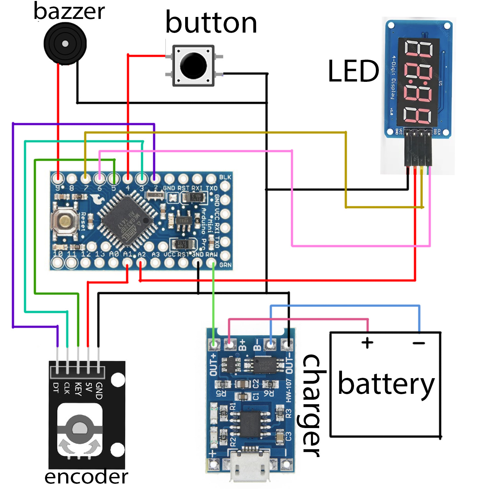

# Simple darkroom timer/stopwatch

> [Инструкция на русском](./README_RU.md)

> 3D model part: https://www.thingiverse.com/thing:6973109

> Demo: https://youtube.com/shorts/RGO38ZYOplA?feature=share

## Main ideas

1. Energy efficiency: if don't touch timer for some time -- it goes to sleep mode. In this mode it consumes 0.3mA. In mnormal mode it consumes 2.5mA. In averege usage it lasts for 4-6 monthes
2. Display has backlight.
3. Simple: device has two big buttons and encoder.

Extra features:
1. You can set pre notification time. You can use it to prepare to finish of the process
2. Long notification for long times. For times long 20 minutes it sets automatically.
3. Each minute notification. Sets automaticelly for 4-20 minutes. Usefull to notify about aggitation.

## How to opperate

* Click main button to start timer. If time is 0 -- it starts stopwatch
* Click main button to pause stopwatch
* Rotate encoder to change time
* Hold encoder to reset time
* Hold main button to turn off display
* Hold encoder and main button to go to settings

### Settings Mode

Name of settings located at the left side of screen
* `PN`: Pre notify
* `LN`: Long notify
* `EN`: Every minute notify

## Hardware

1. [LED TM1637](https://sl.aliexpress.ru/p?key=JlZ4GYP)
2. [Encoder EC11](https://sl.aliexpress.ru/p?key=XLZ4G8M) --  saw off the top you to shorten it
3. [Tactile button](https://sl.aliexpress.ru/p?key=JxO4Gkf)
4. [Buzzer](https://sl.aliexpress.ru/p?key=tHIeGkI)
5. [Battery](https://sl.aliexpress.ru/p?key=B1G4GWz)
6. [Charger module](https://sl.aliexpress.ru/p?key=XfG4GBb)
7. [Arduino pro mini 3.3V](https://sl.aliexpress.ru/p?key=6zG4GHJ). You need to broke central LED on it to decrease power consumption:)

### Scheme


### 3D Body

https://www.thingiverse.com/thing:6973109

## Build and upload code to Arduino

If you want just upload code to your arduino without modification, then the simpliest way to do it is using of Arduino IDE
1. Install Arduino IDE
2. Clone this git project to any folder
3. Open ino file from Arduino IDE (`File`->`Open...`->`path to .ino` file)
4. Install dep libreries (`Tools` -> `Manage Libraries...`):
   * EncButton
   * GyverSegment
   * GyverPower
   * PinChangeInterrupt
5. Choose your board -- Arduino Micro and processor -- ATmega328P (3.3V MHz)
6. `Sketch` -> `Upload Using Programmer`

If you want to modify this code, then I recomment to use PlatfromIO:

```bash
# upload to device
pio run -t upload
```

## Frequent problems

*Problem:* Time goes 2 times faster/slower
*Answer:* Check processor at Arduino IDE. You probably uploaded 16MHz to 8MHz Arduino or vise versa.

## Support

If you have any questions, problems or suggestions, you are welcome to write me:)

Petr:<br>
tg: [@lo1ol](http://t.me/lo1ol)<br>
email: [myprettycapybara@gmail.com](mailto:myprettycapybara@gmail.com?subject=Darkroom%20timer)
