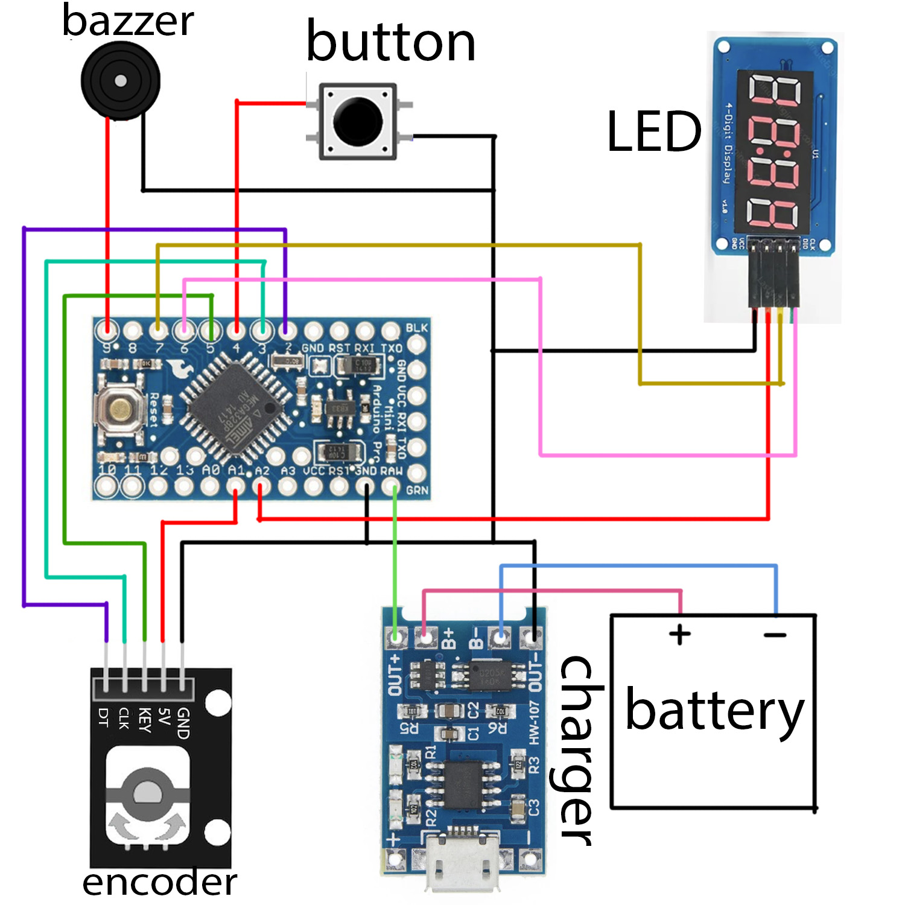

# Простой таймер/секундомер для даркрума

> Корпус: https://www.thingiverse.com/thing:6973109

> Демонстрация: https://youtube.com/shorts/RGO38ZYOplA?feature=share

## Основные принципы

1. Энергоэффективность: Если не трогать таймер в течении 5 минут, он автоматически уйдет в сон. В этом режиме он потребляет 0.3mA. В нормальном состоянии устрйоство потребяет 2.5mA. Этого должно хватить на 4-6 месяцев при среднем использовании
2. Есть подсветка на дисплее
3. Простота: Устройство имеет две кнопки и энкодер

Доп фичи:
1. Можно выставить предварительное уведомление. Можно использовать для напоминания вытащить бумагу их проявителя и дать стечь проявителю
2. Долгий сигнал при окончании времен больше 20 минту
3. Уведомление на каждую минуту. Выставится автоматически для времен с 4-20 минут. Удобно, чтобы напоминанть агитировать

## Как использовать

* Кликни основную кнопку, чтобы запустить таймер/секундомер
* Кликни основную кнопку, чтобы поставить на паущу секундомер
* Крути энкодер, чтобы остановить время
* Удерживай энкоддер, чтобы сбросить время/таймер
* Удерживай основную кнопку, чтобы выключить дисплей
* Удерживай энкодер и основную кнопку, чтобы перейти в настройки

### Режим настроек

Имя настройка показывается в левой части экрана:
* `PN`: Pre notify
* `LN`: Long notify
* `EN`: Every minute notify

## Hardware

1. [LED TM1637](https://sl.aliexpress.ru/p?key=JlZ4GYP)
2. [Encoder EC11](https://sl.aliexpress.ru/p?key=XLZ4G8M) -- вам нужно будет укоротить его отпилив верхушку
3. [Tactile button](https://sl.aliexpress.ru/p?key=JxO4Gkf)
4. [Buzzer](https://sl.aliexpress.ru/p?key=tHIeGkI)
5. [Battery](https://sl.aliexpress.ru/p?key=B1G4GWz)
6. [Charger module](https://sl.aliexpress.ru/p?key=XfG4GBb)
7. [Arduino pro mini 3.3V](https://sl.aliexpress.ru/p?key=6zG4GHJ). Вам нужно сломать центральный LED, чтобы уменьшить энергопотребление

### Scheme


### 3D Body

https://www.thingiverse.com/thing:6973109

## Сборка и загрузка прошивки на Arduino

Если вы хотите просто собрать прошивку и залить ее без изменений, то самый простой способ сделать это -- использовать Arduino IDE
3. Поставте Arduino IDE
1. Склонируйе этот git проект в любую из директорий
2. Откройте ino файл через Arduino IDE (`File`->`Open...`->`path to .ino` file)
4. Установите зависимости проекта (`Tools` -> `Manage Libraries...`):
   * EncButton
   * GyverSegment
   * GyverPower
   * PinChangeInterrupt
5. Выберете board -- Arduino Nano и processor --  ATmega328P (3.3V MHz)
6. Нажмите на кнопку Upload

Если вы хотите модифицировать код, то я советую работать с проектом через PlatfromIO


```bash
# upload to device
pio run -t upload
```

## Поддержка

Если есть вопросы, проблемы и предложения, то можете писать нам:)

Петя:<br>
tg: [@lo1ol](http://t.me/lo1ol)<br>
email: [myprettycapybara@gmail.com](mailto:myprettycapybara@gmail.com?subject=Darkroom%20timer)
